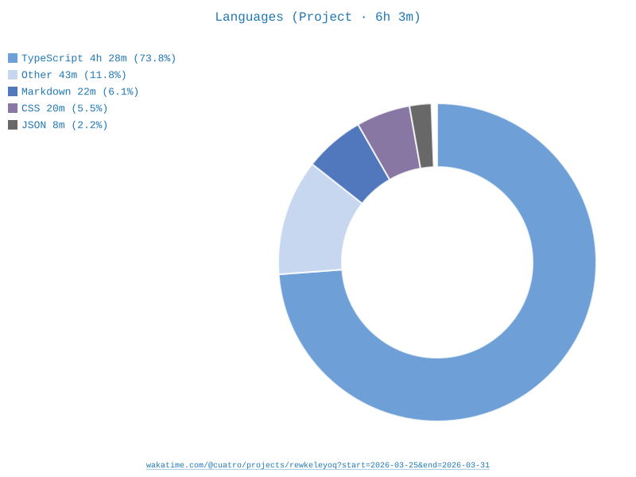

# Ad Analysis Dashboard

A single-page political ad analysis dashboard built for the PharosGraph frontend challenge.

- Live: <https://ad-analysis.cuatro.dev/>

## Setup

```shell
npm install && npm run dev
```

## Stack

- React 19
- TypeScript (strict)
- Vite
- Tailwind CSS v4
- TanStack Query
- Zustand
- Recharts
- GSAP
- Radix UI
- Vitest + RTL

## Approach

The dashboard is organized into three explicit layers:

1. A data layer: TanStack Query fetchers wrapping local JSON with simulated latency.
2. A state layer: Zustand store for selection and sync.
3. A presentation layer: React components that consume from both.

No component below the organism level imports from the store directly.

## Key Decisions

### TanStack Query over useEffect + useState

TanStack Query gives loading/error/stale states, caching, and background refetch semantics with a custom fetcher that wraps the local JSON. The 800ms delay forces the loading skeleton to render same UX as a real API call.

### Segment-based text rendering over innerHTML

Character-position highlights are built by treating every flag boundary as a split point and reducing to a flat segment array. Each segment renderes as a React element, type-safe, testable, and able to carry typed events handlers. The overlap strategy (highest severity wins) is documented and covered by tests. innerHTML would require sanitization and cannot attach typed handlers.

### Zustand over Context + useReducer

`selectedFlagId` is the single source of thruth for flag-to-text synchronization. `FlagTable` writes it on row click. `TextViewer` reads it to scroll and highlight. Both components react to the same store slice independently with no prop drilling through 4+ levels.

### Custom SVG Gauge over a library

A 270deg arc gauge animated with GSAP is more visually disntictive than any off-the-shelf component. The arc draws itself on mount and re-animates on anlysis switch using `useGSAP` from `@gsap/react`, the official React integration that handles cleanup and StrictMode correctly (instead of `useLayoutEffect`).

### Radix UI Popover over a custom tooltip

Popover position is genuinely hard near viewport edges. Radix handles collision detection, focus management, and keyboard dismiss.

## What I'd Improve with more Time

- Virtualize the flag table and text segments for ads with 50+ flags.
- Add keyboard nevigation between highlights in the text viewer (Tab key cycles through flagged spans).
- Persist comparison selections in URL state so the view is shareable.
- E2E test with Playwright covering the full flag-to-text sync flow.
- The flag `start`/`end` positions in the provided dataset have minor offsets from the actual text positions. See the [notes](#notes)section below for debugging script.

## Time Spent

[](https://wakatime.com/@cuatro/projects/rewkeleyoq?start=2026-03-25&end=2026-03-31)



## Notes

### Flag position debugging

The character positions (`start`/`end`) in `src/data/analyses.json` were provided by the dataset and may not align exactly with the `adText` string. If highlights appear offset, run this in the browser console to check the positions.

```js
const analyses = await fetch('/src/data/analyses.json').then(r => r.json());
const a = analyses.analyses[0];

a.flags.forEach(f => {
  const start = a.adText.indexOf(f.text);
  const end = start + f.text.length;
  console.log(`${f.id}: start=${start}, end=${end} (JSON has ${f.start}/${f.end})`);
})
```
